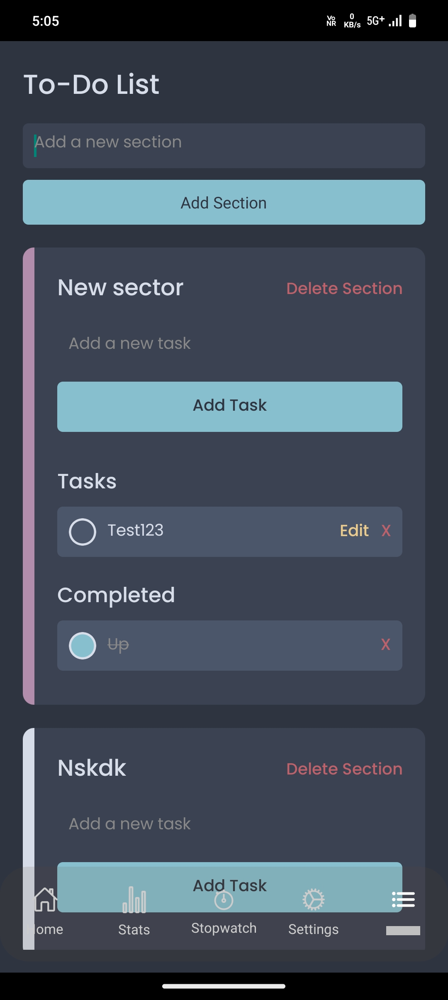
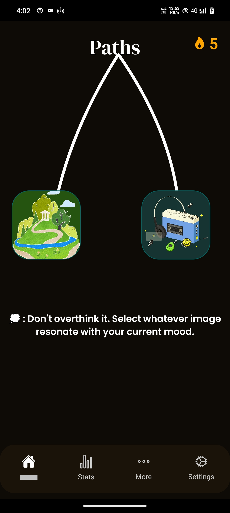

# "Usider" App

it is a interactive music & timer app. it provides smoothing calm musics combined with great visual that help you to focus & orgnaise your time.

# Future

this is initial version of app and so there is lot and lot of stuff to be adeed. 

# Screenshots







# Running This locally

**This is made using expo-workflow so use expo to run this project**

```npx expo start --tunnel/--localhost```

# Use of AI

*AI refers to copilot only(no other ai is used in any form), copilot was being using to refactor code, help in error fixing, and very rarely for fast generation of component*

*The path/[id] component was refactored using AI and this was one and only use of AI in refactoring*

